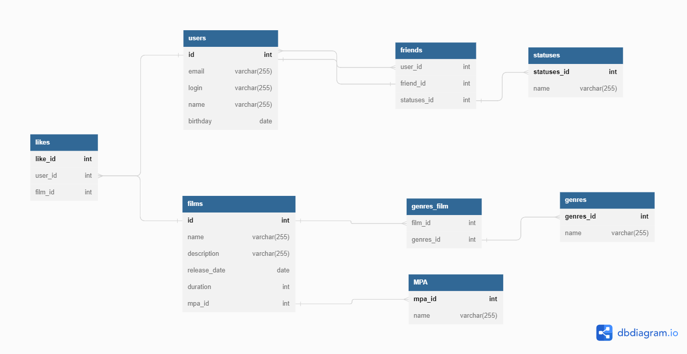

# java-filmorate
Template repository for Filmorate project.

## Краткое описание БД - из каких таблиц и представлений состоит.  
___
### Диаграмма БД.  
  

#### Таблицы:

1. **users**

   user_id - целочисленный идентификатор (**первичный ключ**);  
   email - электронная почта;
   login - логин пользователя;  
   name - имя пользователя (для отображения);  
   birthday - дата рождения.

2. **films**   
   
   film_id - целочисленный идентификатор (**первичный ключ**);  
   name - название;
   releaseDate - дата релиза;
   duration - продолжительность фильма;
   description - описание;
   mpa_id - целочисленный идентификатор рейтинга;

3. **genre**

   genre_id - целочисленный идентификатор **первичный ключ**;  
   genre_name - название жанра.

4. **mpa**

   mpa_id - целочисленный идентификатор **первичный ключ**;  
   mpa_name - значение.

5. **user_friends**

   user_id - целочисленный идентификатор пользователя;  
   friend_id - целочисленный идентификатор пользователя.  
   _Первичный ключ комплексный (1 и 2 поля)_

6. **film_genre**

   film_id - целочисленный идентификатор фильма;  
   genre_id - целочисленный идентификатор рейтинга.  
   _Первичный ключ комплексный (1 и 2 поля)_

7. **film_likes**

   film_id - целочисленный идентификатор фильма;  
   user_id - целочисленный идентификатор пользователя.  
   _Первичный ключ комплексный (1 и 2 поля)_

### Пояснение к схеме - описание таблиц, логики, связей и задачи, которые можно решить, используя БД.

#### Таблица users

Таблица содержит список пользователей приложения.   
Каждый пользователь идентифицируется целочисленным идентификатором (user_id).  
Поля электронная почта (email), логин (login), дата рождения (birthday)- обязательно должны содержать данные.  
В поле дата рождения (birthday) входит только дата (тип данных date).

#### Таблица films

Таблица содержит список фильмов.   
Каждый фильм идентифицируется целочисленным идентификатором (film_id).  
Поля название (name), описание (description), продолжительность фильма (duration) и
идентификатор рейтинга (mpa_id) - обязательно должны содержать данные.  
Максимальная длина описания — 200 символов.

#### Таблица genre

Таблица содержит список жанров фильма.
Каждый жанр идентифицируется целочисленным идентификатором (genre_id).  
Поле название жанра (genre_name) - обязательно для заполнения.  
Список возможных значений:
* Комедия.
* Драма.
* Мультфильм.
* Триллер.
* Документальный.
* Боевик.

#### Таблица mpa
Таблица содержит список рейтингов Ассоциации кинокомпаний.  
Каждый рейтинг идентифицируется целочисленным идентификатором (mpa_id).    
Поле mpa_name - обязательно для заполнения.  
Эта оценка определяет возрастное ограничение для фильма. Значения могут быть следующими:
* G — у фильма нет возрастных ограничений,
* PG — детям рекомендуется смотреть фильм с родителями,
* PG-13 — детям до 13 лет просмотр не желателен,
* R — лицам до 17 лет просматривать фильм можно только в присутствии взрослого,
* NC-17 — лицам до 18 лет просмотр запрещён.

#### Таблица user_friends

Таблица содержит список друзей пользователя и статус подтверждения дружбы.  
Данная таблица связывает идентификаторы пользователей из таблицы **users**, которые подали заявку
в друзья. Каждая пара user_id - friend_id является уникальной.
С помощью данной таблицы можно получить список общих друзей с другим пользователем.

#### Таблица film_genre

С помощью данной таблицы связывается идентификаторы таблиц films и genre.
Каждая пара в таблице должна быть уникальна.

#### Таблица film_likes

С помощью данной таблицы связывается идентификаторы таблиц films и users.
Каждая пара в таблице должна быть уникальна.

### Бизнес задачи, которые можно решить, используя БД

1. **Получение всех фильмов, пользователей**:
```
SELECT *
FROM films;

SELECT *
FROM users;
```
2. **Список общих друзей с другим пользователем**:
```
SELECT friend_id
FROM user_friends
WHERE user_id = 2
AND friend_id in (SELECT friend_id
                  FROM user_friends
                  WHERE user_id = 1);
```
3. **Вывод 10 наиболее популярных фильмов**:
```
SELECT fl.film_id, f.name, COUNT(pf.id_user) AS count
FROM film_likes AS fl
INNER JOIN films AS f ON fl fl.film_id = f.film_id
GROUP BY fl.film_id, f.name
ORDER BY count DESC
LIMIT 10;
```